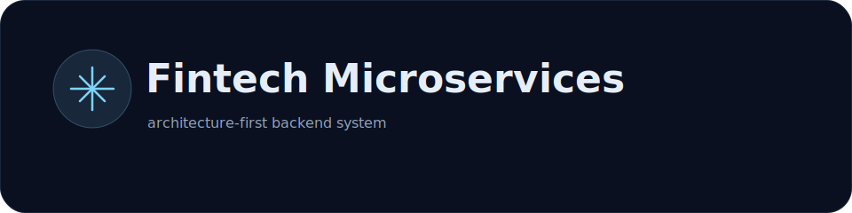

  

  
  
  

##  Tech Stack

  

##  About Me

Sou desenvolvedor backend Java júnior construindo minha evolução para me tornar um engenheiro backend forte em arquitetura de software, APIs REST, microservices, mensageria e cloud.
Este perfil foi desenhado para comunicar uma identidade técnica clara: organização, consistência e paixão por sistemas bem construídos.
- Trabalho com Java e Spring Boot no desenvolvimento de APIs e serviços backend.
- Tenho interesse em arquitetura limpa, DDD, design patterns e evolução de sistemas distribuídos.
- Gosto de entender o comportamento do sistema, não apenas entregar código funcional.
- Meu foco é crescer com rigor técnico, visão de produto e consciência de escala.

## Featured Project

  

Projeto destaque do perfil, pensado como um ecossistema de fintech baseado em microserviços, com comunicação assíncrona, persistência separada por contexto e foco em evolução arquitetural.
- API Gateway para entrada unificada.
- Serviços especializados por domínio.
- RabbitMQ como espinha dorsal de eventos.
- PostgreSQL com persistência organizada por contexto.
- Observabilidade e readiness para ambientes cloud.
  Saiba mais em [docs/fintech-microservices/README.md](docs/fintech-microservices/README.md)
- https://github.com/DouglasGMenezes/fintech-microservices

---

  
  

## Contribution Snake

  

---

  

---

  

   <b>Obrigado por visitar meu perfil!</b>

