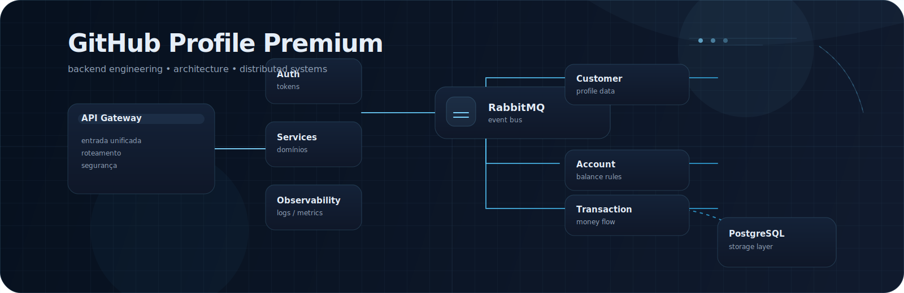
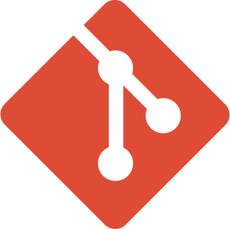

# Hi there! I'm Douglas

  

Backend Java Developer focado em arquitetura, sistemas distribuídos e qualidade de software.

  
  
  

## Tech Stack

## 1. Hero Section

Sou desenvolvedor backend Java júnior construindo minha evolução para me tornar um engenheiro backend forte em arquitetura de software, APIs REST, microservices, mensageria e cloud.

Este perfil foi desenhado para comunicar uma identidade técnica clara: organização, consistência e paixão por sistemas bem construídos.

## 2. About Me

- Trabalho com Java e Spring Boot no desenvolvimento de APIs e serviços backend.
- Tenho interesse em arquitetura limpa, DDD, design patterns e evolução de sistemas distribuídos.
- Gosto de entender o comportamento do sistema, não apenas entregar código funcional.
- Meu foco é crescer com rigor técnico, visão de produto e consciência de escala.

## 3. Current Journey

- Fortalecendo base em Java moderno e ecossistema Spring.
- Estudando decisões de arquitetura aplicadas a microservices.
- Evoluindo em mensageria com RabbitMQ, observabilidade e resiliência.
- Aprimorando ambiente de entrega com Docker, GitHub Actions e boas práticas de CI/CD.

## 4. Featured Project

### Fintech Microservices

  

Projeto destaque do perfil, pensado como um ecossistema de fintech baseado em microserviços, com comunicação assíncrona, persistência separada por contexto e foco em evolução arquitetural.

- API Gateway para entrada unificada.
- Serviços especializados por domínio.
- RabbitMQ como espinha dorsal de eventos.
- PostgreSQL com persistência organizada por contexto.
- Observabilidade e readiness para ambientes cloud.

Saiba mais em [docs/fintech-microservices/README.md](docs/fintech-microservices/README.md)
- https://github.com/DouglasGMenezes/fintech-microservices

## 5. GitHub Stats

  

## 6. Contribution Snake

  

## 7. GitHub Streak

  

## 8. Goals

- Me tornar um backend engineer sólido em Java.
- Construir sistemas com arquitetura clara e comunicação confiável.
- Ser consistente em qualidade, testabilidade e legibilidade.
- Desenvolver repertório técnico suficiente para atuar com autonomia crescente em times maduros.

## 9. Contact

  

## 10. Visitor Counter

  

  *** Obrigado por visitar meu perfil! ***

