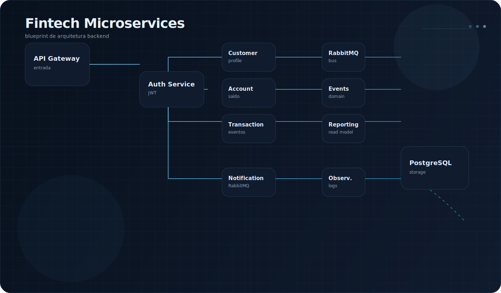

# Fintech Microservices

<p align="center">
  
</p>

## Visão Geral

Fintech Microservices é o projeto principal do perfil. A proposta é demonstrar evolução em engenharia backend por meio de uma arquitetura modular, orientada a domínio e pronta para escalar.

O objetivo não é apenas entregar funcionalidades financeiras. O foco é mostrar critérios de engenharia:

- fronteiras bem definidas;
- comunicação explícita entre serviços;
- persistência desacoplada;
- rastreabilidade;
- resiliência;
- facilidade de evolução.

## Arquitetura

<p align="center">
  
</p>

### Componentes principais

- API Gateway: ponto único de entrada.
- Auth Service: autenticação e autorização.
- Customer Service: dados de cliente e perfil.
- Account Service: contas, saldos e regras de domínio.
- Transaction Service: operações financeiras.
- Notification Service: eventos e comunicação assíncrona.
- Reporting Service: consolidação e leitura otimizada.
- RabbitMQ: integração entre contextos.
- PostgreSQL: persistência por serviço.

## Diagrama

O diagrama foi construído em SVG no estilo blueprint para reforçar a leitura arquitetural e manter consistência visual com o banner do perfil.

## Tecnologias

- Java
- Spring Boot
- REST APIs
- RabbitMQ
- PostgreSQL
- Docker
- GitHub Actions
- Observability stack
- Clean Architecture

## Estrutura do Projeto

O projeto deve seguir uma organização por contexto, com cada serviço contendo sua própria aplicação, configuração e persistência.

Exemplo de estrutura:

```text
fintech-microservices/
├── api-gateway/
├── auth-service/
├── customer-service/
├── account-service/
├── transaction-service/
├── notification-service/
├── reporting-service/
├── shared-kernel/
├── infra/
└── docs/
```

## Microserviços

### API Gateway

- Roteamento de requisições.
- Padronização de entrada.
- Regras transversais.

### Auth Service

- Login.
- Emissão de tokens.
- Autorização por perfil.

### Customer Service

- Cadastro.
- Perfil.
- Dados básicos de cliente.

### Account Service

- Contas.
- Saldo.
- Regras de consistência financeira.

### Transaction Service

- Débito.
- Crédito.
- Histórico.

### Notification Service

- Disparo de eventos.
- Comunicação assíncrona.

### Reporting Service

- Views de leitura.
- Indicadores.
- Consolidação de informações.

## Comunicação Entre Serviços

- REST para consultas e fluxos síncronos.
- RabbitMQ para eventos e integração assíncrona.
- Idempotência para evitar duplicidade de processamento.
- Retry com política controlada.
- Dead-letter queue para falhas persistentes.

## RabbitMQ

RabbitMQ é a camada de mensageria da solução. Ele reduz acoplamento entre serviços e permite modelar integrações orientadas a eventos.

Casos de uso principais:

- `transaction.created`
- `account.balance.updated`
- `notification.requested`
- `reporting.event.received`

## Banco de Dados

- PostgreSQL por serviço ou por bounded context.
- Migrações versionadas.
- Índices alinhados com consultas de leitura.
- Separação entre escrita transacional e leitura analítica quando necessário.

## Autenticação

- JWT como base.
- Claims enxutas.
- Expiração controlada.
- Autorização por papéis e escopos.

## Roadmap

- Finalizar contratos entre serviços.
- Implementar observabilidade.
- Consolidar pipelines de build e deploy.
- Cobrir regras de domínio com testes automatizados.
- Evoluir a camada de segurança.

## Deploy

- Docker para containers locais.
- Compose para orquestração de desenvolvimento.
- Evolução futura para cloud com serviços gerenciados.

## Documentação

- README por serviço.
- Diagrama de arquitetura.
- Registro de decisões arquiteturais.
- Fluxos críticos documentados.

## Objetivos

- Mostrar domínio de backend Java.
- Evidenciar capacidade de organizar sistemas complexos.
- Transmitir maturidade em arquitetura e comunicação entre serviços.

## Futuras Melhorias

- Circuit breaker.
- Observabilidade distribuída com tracing.
- Processamento assíncrono mais sofisticado.
- Versionamento explícito de eventos.
- Testes de contrato entre serviços.
